```{r}
#| echo: false
#| output: false
#| code-fold: true
#| code-summary: "code"

# working environment ####

# cleaning R start
rm(list=ls()); gc()

# loading libraries
libraries = c( 
  # general purpose
  'here',
  # experimental design
  'FrF2','daewr','rsm'
) 
# sapply(libraries, install.packages, character.only=T)
sapply(libraries, require, character.only=T)

# sourcing used defined functions (udf)
source( file.path(here(), 'code', 'udf.R') )

seed = 12345

```


---

## Motivating example {style="font-size:60%;"}

**Context:**

- Interested in high-value protein production process
- Subject matter experts think the current operating conditions may be sub-optimal
- Subject matter experts have identified seven ($7$) factors may affect the process yield ($Y$).

For example,

| Variable | Factor           | Range       | Units |
| :---     | :---             | :---        | :---  |
| $A$      | pH               | $0.0-14.0$  |       |
| $B$      | Temp             | $0.0-100.0$ | C     |
| $C$      | Incubation time  | $0-96$      | h     |
| $D$      | Agitation speed  | $0-1000$    | RPM   |
| $E$      | Initial glucose  | $0-30$      | g/l   |
| $F$      | Dissolved oxygen | $0-100$     | %     |
| $G$      | Inoculum volume  | $0-100$     | %     |

---

## Motivating example {style="font-size:60%;"}

**Goal:** 

1. *Screen* relevant factors that affect the process
2. Find the *optimal* yield


**Constraint:** Minimize experimental runs, because laboratory experiments are:

- Time-consuming
- Resource-intensive
- Expensive


---

## Motivating example {style="font-size:60%;"}

What are our current operating conditions? 

```{r}
#| echo: false
#| output: true
#| code-fold: true
#| code-summary: "code"

# number of factors
k = 7 

# Current operating conditions
d0 = data.frame( matrix( c(2, 10, 5, 100, 10, 20, 20), nrow=1, ncol=7) )
names(d0) = LETTERS[1:k]

set.seed( seed )
d0$Y = true_protein_yield( X=as.matrix(d0) )

```

```{r}
#| echo: false
#| output: true
#| code-fold: true
#| code-summary: "code"

# plot
twi = list( c(1,2), c(3,2),
            c(1,3), c(3,4) )
mr = c(14, 100, 24*4, 1000, 30, 100, 100)

par( mfrow=c(2,2) )
for( j in 1:length(twi) ){
  idx = !names(d0) %in% c( names(d0)[ twi[[j]] ], 'Y' )
  nam = paste( 
    names(d0)[ twi[[j]][1] ],'\n',
    paste( names(d0)[idx], '=', d0[,idx], collapse=', ') )
  
  plot( d0[,twi[[j]]], 
        pch=19, col=rgb(0,0,0,0.5),
        ylim=c( 0, mr[ twi[[j]][2] ] ),
        xlim=c( 0, mr[ twi[[j]][1] ] ), 
        ylab=names(d0)[ twi[[j]][2] ],
        xlab=nam )
  text( d0[,twi[[j]]] + 1, labels =round(d0$Y,1) )
}
par( mfrow=c(1,1) )

```

:::{.notes}
there is so much **parameter space** to explore!
:::


---

## Step 1: Identify relevant factors {style="font-size:60%;"}

Subject matter experts have determined the restricted region of interest within the seven factor space, illustrated using factors A and B.

```{r}
#| echo: false
#| output: true
#| code-fold: true
#| code-summary: "code"

# plot
par( mfrow=c(1,1) )
idx = !names(d0) %in% c( names(d0)[ 1:2 ], 'Y' )
nam = paste( 
  names(d0)[ 1 ],'\n',
  paste( names(d0)[idx], '=', d0[,idx], collapse=', ') )

plot( d0[,1:2], pch=19, col=rgb(0,0,0,0.5),
      ylim=c( 0, mr[ 2 ] ), xlim=c( 0, mr[ 1 ] ), 
      ylab=names(d0)[ 2 ], xlab=nam )
rect( 0, 0, 4, 20, lty=2 )
text( d0[,1:2] + 0.5, labels =round(d0$Y,1) )

```

:::{.notes}
To facilitate the explanation, we focus on factors A and B, but the ideas presented here apply equally to the remaining factors.

Similar to an **Evolutionary Operations (EVOP)** process, where the planned changes in the key process variables:

1. are small enough so the product output is not degraded.
2. are big enough so potential improvements can be recognized.
:::


---

## Step 1: Identify relevant factors {style="font-size:60%;"}

Subject matter experts have determined the restricted region of interest within the seven factor space, illustrated using factors A and B.

```{r}
#| echo: false
#| output: true
#| code-fold: true
#| code-summary: "code"

# plot
par( mfrow=c(1,1) )
idx = !names(d0) %in% c( names(d0)[ 1:2 ], 'Y' )
nam = paste( 
  names(d0)[ 1 ],'\n',
  paste( names(d0)[idx], '=', d0[,idx], collapse=', ') )

plot( d0[,1:2], pch=19, col=rgb(0,0,0,0.5),
      ylim=c( 0, 20 ), xlim=c( 0, 4 ), 
      ylab=names(d0)[ 2 ], xlab=nam )
text( d0[,1:2] + 0.15, labels =round(d0$Y,1) )

```


---

## Step 1: Identify relevant factors {style="font-size:60%;"}

Two options: 

- A **$2^{k}$ full factorial design  (CRFD)** [@Lawson_2015]:
  
  * [Benefit:]{.underline} estimates the intercept, all $7$ main effects, $21$ two-factor interactions, $7$ pure quadratic terms, and higher-order effects.
  * [Drawback:]{.underline} requires $2^{k} = 2^{7} = 128$ experimental runs.

- A **resolution III fractional factorial design (CRFF)** [@Lawson_2015]: 
  
  * [Benefit:]{.underline} requires only $2^{k-p} = 2^{7-4} = 8$ experimental runs when using $p=4$ generators. 
  * [Drawbacks:]{.underline} estimates only the intercept and the $7$ main effects, has no $\text{df}$, and main effects are *aliased* with two-factor interactions.

Because we are **screening** we choose the second option.

:::{.notes}
:::

---

## Step 1: Identify relevant factors {style="font-size:60%;"}

In a **resolution III CRFF design**, what does it mean to be *aliased*?

```{r}
#| echo: false
#| output: true
#| code-fold: true
#| code-summary: "code"

# design CRFF
set.seed( seed )
dsg = FrF2( nfactors=k, resolution=3 )

# checking design
colormap(dsg, mod=2)

```

:::{.notes}

```{r}
#| echo: false
#| output: true
#| code-fold: true
#| code-summary: "code"

# checking design
print('Aliases')
y = runif( nrow(dsg), 0, 1)
aliases( lm( y~(.)^2, data=dsg) )

```

Three principles

a. Effect Sparsity-Pareto S(P): 
    
    around 80% of the variability is explained by 20% of the factors

b. Hierarchical ordering H: 

    main effects are more likely to be important than two-factor interactions, and this more important than three-factor interactions and so on.
    
c. Heredity-Marginality H(M): 

    usually interactions occur between factors where at least one of the two main effects are significant.


:::


---

## Step 1: Identify relevant factors {style="font-size:60%;"}

But how does it looks like in the factor space?

```{r}
#| echo: false
#| output: true
#| code-fold: true
#| code-summary: "code"

# convert to data.frame
d = data.frame( as.matrix(dsg[,1:k]) ) # design
d = sapply(d, as.integer)
d = data.frame(d)

# create natural variables
nv = rbind( 
  d0[,-ncol(d0)], # central points
  c(3-1, 15-5, 6-4, 150-50, 15-5, 30-10, 30-10) # ranges to test
)
for( j in 1:k ){
  d[,j] = d[,j]*nv[2,j]/2 + nv[1,j] 
}

```

```{r}
#| echo: false
#| output: true
#| code-fold: true
#| code-summary: "code"

# plot
par( mfrow=c(1,1) )
idx = !names(d0) %in% c( names(d0)[ 1:2 ], 'Y' )
nam = paste( 
  names(d0)[ 1 ],'\n',
  paste( names(d0)[idx], '=', d0[,idx], collapse=', ') )

plot( d0[,1:2], pch=19, col=rgb(0,0,0,0.5),
      ylim=c( 0, 20 ), xlim=c( 0, 4 ), 
      ylab=names(d0)[ 2 ], xlab=nam )
points( d[,1:2], pch=19, col=rgb(0,0,1,0.5) )
legend( 'topleft', legend=c( 'CRFF candidates','current OC' ),
        fill=c(rgb(0,0,1,0.5), rgb(0,0,0,0.5)), bty='n' )

```

::: {.notes}
This design happen at every combination of the $7$ factors
:::


---

## Step 1: Identify relevant factors {style="font-size:60%;"}

After conducting the experiments, which factors are relevant?

```{r}
#| echo: false
#| output: true
#| code-fold: true
#| code-summary: "code"

# measure
set.seed( seed )
d$Y = true_protein_yield( X = as.matrix( d[,1:k] ) )

# model for all First Order (FO) effects
model1 = lm( Y ~ A + B + C + D + E + F + G, data=d)
summary(model1)

```


---

## Step 1: Identify relevant factors {style="font-size:60%;"}

Thanks to the Central Limit Theorem (CLT) we can still find which factors are relevant.

```{r}
#| echo: false
#| output: true
#| code-fold: true
#| code-summary: "code"

# model for all First Order (FO) effects
fullnormal( coef(model1), alpha=0.025 )

```

::: {.notes}
NO relevance of $D$, which could indicate the presence of 2fi between $A$ and $B$

```{r}
#| echo: false
#| output: true
#| code-fold: true
#| code-summary: "code"

# checking design
print('Aliases')
y = runif( nrow(dsg), 0, 1)
aliases( lm( y~(.)^2, data=dsg) )

```

:::


---

## Step 1: Identify relevant factors {style="font-size:60%;"}

Reducing the model to relevant main effects,

```{r}
#| echo: false
#| output: true
#| code-fold: true
#| code-summary: "code"

# reduced model for First Order (FO) effects
model2 = lm( Y ~ A + B + C, data=d)
summary(model2)

```


---

## Step 1: Identify relevant factors {style="font-size:60%;"}

Reducing the model to relevant main effects,

```{r}
#| echo: false
#| output: true
#| code-fold: true
#| code-summary: "code"

# reduced model for First Order (FO) effects
model3 = lm( Y ~ A + B, data=d)
summary(model3)

```


---

## Step 2: Steepest ascend {style="font-size:60%;"}

To build a model that describes the yield space, we need to add some *center points*,

```{r}
#| echo: false
#| output: true
#| code-fold: true
#| code-summary: "code"

# experiment block
d$block = 'screen'

# add some center points
for( i in 1:4 ){
  d = rbind( d, data.frame( d0[,-ncol(d0)], Y=NA, block='center') )
}

# plot
par( mfrow=c(1,1) )
plot( d[,1:2], pch=19, col=rgb(0,0,1,0.5),
      ylim=c( 0, 20 ), xlim=c( 0, 4 ) ) 
legend( 'topleft', legend=c( 'CRFF design +\ncenter points' ),
        fill=rgb(0,0,1,0.5), bty='n' )

```

---

## Step 2: Steepest ascend {style="font-size:60%;"}

And we check these points are no different than the rest, 

```{r}
#| echo: false
#| output: true
#| code-fold: true
#| code-summary: "code"

# measure
set.seed( seed )
d$Y[is.na(d$Y)] = true_protein_yield( X = as.matrix( d[is.na(d$Y),1:k] ) )

# model with blocks
d$block = factor(d$block)
model4 = lm( Y ~ A + B + block, data=d)
summary(model4)


```

---

## Step 2: Steepest ascend {style="font-size:60%;"}

We model the *local* yield surface using **response surface methodology (RSM)** [@Lawson_2015].

```{r}
#| echo: false
#| output: true
#| code-fold: true
#| code-summary: "code"

# model for ascend
model_rsm = rsm( Y ~ FO(A,B), data=d )
summary(model_rsm)

```


---

## Step 2: Steepest ascend {style="font-size:60%;"}

How does the space look like?

```{r}
#| echo: false
#| output: true
#| code-fold: true
#| code-summary: "code"

# direction
sa = steepest( model_rsm, dist=1, descent=F )

# new point
new = d0
check = T
set.seed( seed )
while( check ){
  new$A = new$A + 1
  if( new$A > 13 ){ # defined by subject matter experts
    break
  }
  new$B = round( new$B + with(sa, A/B)*(new$A-2), 1)
  new$Y = true_protein_yield( X = as.matrix( new[,-ncol(new)] ) )
  d = rbind( d, data.frame(new, block='ascend') )
  check = with(d, Y[nrow(d)] - Y[nrow(d)-1] > 0 )
}

```

```{r}
#| echo: false
#| output: true
#| code-fold: true
#| code-summary: "code"

# plot
par( mfrow=c(1,1) )
contour( model_rsm, ~ A+B, image=T,
         ylim=c( 0, 20 ),
         xlim=c( 0, 4 ) )
points( d[ d$block!='ascend', 1:2 ], 
        pch=19, col=rgb(0,0,0,0.5) )

# equation of a line
point1 = d[which( d$block=='center')[1], 1:2 ] 
point2 = d[which( d$block=='ascend')[1], 1:2 ] 
b = ( point2[,2] - point1[,2] ) / ( point2[,1] - point1[,1] )
a = point1[,2] - b*point1[,1]
abline( a=a, b=b, lty=2 )

```

---

## Step 2: Steepest ascend {style="font-size:60%;"}

Now we proceed to ascend towards a maximum,

```{r}
#| echo: false
#| output: true
#| code-fold: true
#| code-summary: "code"

# plot
par( mfrow=c(1,1) )
contour( model_rsm, ~ A+B, image=T,
         ylim=c( 0, 100 ),
         xlim=c( 0, 14 ) )
points( d[, 1:2 ], 
        pch=19, col=rgb(0,0,0,0.5) )
text( d[ d$block=='ascend', 1:2 ] - 0.5, 
      labels = round( d$Y[ d$block=='ascend'],1) )

# equation of a line
abline( a=a, b=b, lty=2 )

```


---

## Step 2: Steepest ascend {style="font-size:60%;"}

And we focus our attention on the highest yield area,

```{r}
#| echo: false
#| output: true
#| code-fold: true
#| code-summary: "code"

# plot
par( mfrow=c(1,1) )
contour( model_rsm, ~ A+B, image=T,
         ylim=c( 0, 100 ),
         xlim=c( 0, 14 ) )
points( d[, 1:2 ], 
        pch=19, col=rgb(0,0,0,0.5) )
text( d[ d$block=='ascend', 1:2 ] - 0.5, 
      labels = round( d$Y[ d$block=='ascend'],1) )

# equation of a line
abline( a=a, b=b, lty=2 )
rect( 11, 55, 13.5, 95, lty=2 )

```


---

## Step 2: Steepest ascend {style="font-size:60%;"}

And we focus our attention on the highest yield area,

```{r}
#| echo: false
#| output: true
#| code-fold: true
#| code-summary: "code"

# plot
par( mfrow=c(1,1) )
contour( model_rsm, ~ A+B, image=T,
         ylim=c( 55, 95 ),
         xlim=c( 11, 13.5 ) )
points( d[, 1:2 ], 
        pch=19, col=rgb(0,0,0,0.5) )
text( d[ d$block=='ascend', 1:2 ] - 0.1, 
      labels = round( d$Y[ d$block=='ascend'],1) )

```

---

## Step 3: Bayesian Optimization {style="font-size:60%;"}

Within this high-yield region, we implement **Bayesian Optimization (BO)** [@Sweet_2023; @Nielsen_2023].

Specifically:

1. We use relevant *initial training data*:
  
    [**Three points from the steepest ascend procedure** located within the high-yield region.]{style="font-size:80%;"}
    
2. We use a *surrogate model* to approximate the yield surface for a set of *candidate data points*:

    [A **Gaussian Process with Radial Basis Function (RBF) kernel** [@Rasmussen_et_al_2015; @Nielsen_2023]. ]{style="font-size:80%;"}

3. We use an *acquisition function* to determine the next point to evaluate in the search space:

    [The **Lower Confidence Bound (LCB)** function.]{style="font-size:80%;"}

4. We define a *stopping criterion* to determine when to terminate the search:

    [A central composite design [@Lawson_2015] requires a total of $12$ runs: $4$ factorial points, $4$ axial (face) points, and $4$ center points.]{style="font-size:80%;"}
    
    [**Our BO procedure will use only $8$ runs.**]{style="font-size:80%;"}
    

---

## Step 3: Bayesian Optimization {style="font-size:60%;"}

```{r}
#| echo: false
#| output: true
#| code-fold: true
#| code-summary: "code"

# initial training points
dBO = tail(d, 3)

# prediction points
A = seq( 11.1, 13.4, by = 0.1 )
B = seq( 60, 90, by = 5 )
x_predict = data.frame( expand.grid( A=A, B=B ) )

```


```{r}
#| echo: false
#| output: true
#| code-fold: true
#| code-summary: "code"

available_indices = 1:nrow(x_predict)
n_runs = 8

# BO procedure
for( n in 1:n_runs ){ 
  
  # posterior predictions for pre-selection
  post_predict = gaussian_process_regression( 
    X_train = dBO[,1:2], 
    X_predict = x_predict, 
    Y_train = dBO$Y, 
    l=1, sigma_f=1, noise=1e-8 )
  
  # lower confidence bound
  LCB_predict = lower_confidence_bound(
    post = post_predict, lambda = 0.5 )
  
  # find the position within available_indices that has the minimum LCB
  rel_idx = which.min( LCB_predict[available_indices] )
  selected_idx = available_indices[rel_idx]
  
  # add point to list of training data
  Xn = data.frame( x_predict[selected_idx, ], dBO[1, 3:7] )
  set.seed( seed )
  Yn = true_protein_yield( X = as.matrix( Xn ) )
  dBO = rbind( dBO, data.frame( Xn, Y=Yn, block='BO' ) )
  
  # remove the index we just sampled
  available_indices = available_indices[-rel_idx]
  
  # plot for yield space
  png( file.path( here(), 'figures', paste0('BO_yield_space', n,'.png') ),
       width=15, height=12, units='cm', res=150 )
   
  plot( dBO[ 1:(nrow(dBO)-1), 1:2 ], pch=19, col=rgb(0,0,0,0.5),
        ylim=c( 55, 105 ), xlim=c( 11, 13.5 ),
        main=paste0( 'Protein Yield Surface, step ', n) )
  text( dBO[ 1:(nrow(dBO)-1), 1:2 ] - 0.1, 
        labels = round( dBO$Y[ 1:(nrow(dBO)-1) ],1) )
  points( x_predict, pch=19, col=rgb(0,0,1,0.2) )
  
  mu = matrix( post_predict$mu, nrow=length(A), ncol=length(B), byrow=T)
  contour( x=A, y=B, z=mu, lwd=1.5, add=T, labcex=0.9, method='edge', 
           col=hcl.colors(15, "Grays")[15:1] )
  
  points( dBO[ nrow(dBO), 1:2 ], pch=19, col='red' )
  text( dBO[ nrow(dBO), 1:2 ] - 0.1, 
        labels = round( dBO$Y[ nrow(dBO) ],1) )
  legend( 'topleft', bty='n',
          fill=c( rgb(0,0,0,0.5), rgb(0,0,1,0.2), 'red' ),
          legend=c( 'Training data', 'Candidate points', 'Selected point' ) )
  
  dev.off()
  
  
  # plot for for LCB
  png( file.path( here(), 'figures', paste0('BO_lcb_space', n,'.png') ),
       width=15, height=12, units='cm', res=150 )
  
  plot( dBO[ 1:(nrow(dBO)-1), 1:2 ], pch=19, col=rgb(0,0,0,0.5),
        ylim=c( 55, 105 ), xlim=c( 11, 13.5 ),
        main=paste0( 'LCB surface, step ', n) )
  text( dBO[ 1:(nrow(dBO)-1), 1:2 ] - 0.1, 
        labels = round( dBO$Y[ 1:(nrow(dBO)-1) ],1) )
  points( x_predict, pch=19, col=rgb(0,0,1,0.2) )
  
  lcb = matrix( LCB_predict, nrow=length(A), ncol=length(B), byrow=T)
  contour( x=A, y=B, z=lcb, lwd=1.5, add=T, labcex=0.9, method='edge',
           col=hcl.colors(15, "Grays")[15:1] )
  
  points( dBO[ nrow(dBO), 1:2 ], pch=19, col='red' )
  text( dBO[ nrow(dBO), 1:2 ] - 0.1, 
        labels = round( dBO$Y[ nrow(dBO) ],1) )
  legend( 'topleft', bty='n',
          fill=c( rgb(0,0,0,0.5), rgb(0,0,1,0.2), 'red' ),
          legend=c( 'Training data', 'Candidate points', 'Selected point' ) )
  
  dev.off()
  
}

```


::: {layout-nrow=2 layout-ncol=2}

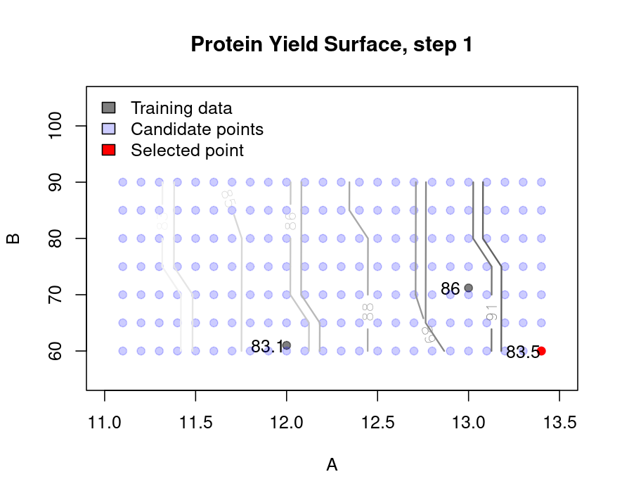{width=72%}

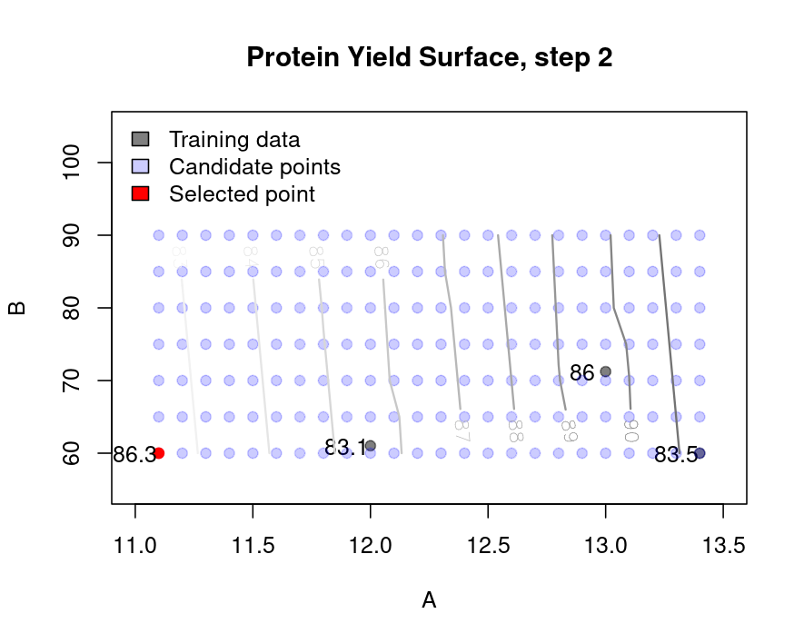{width=72%}

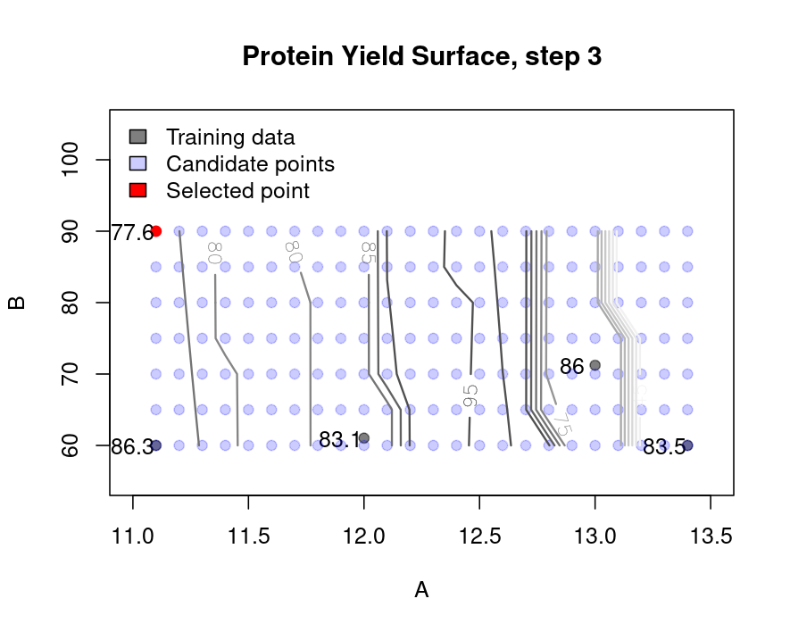{width=72%}

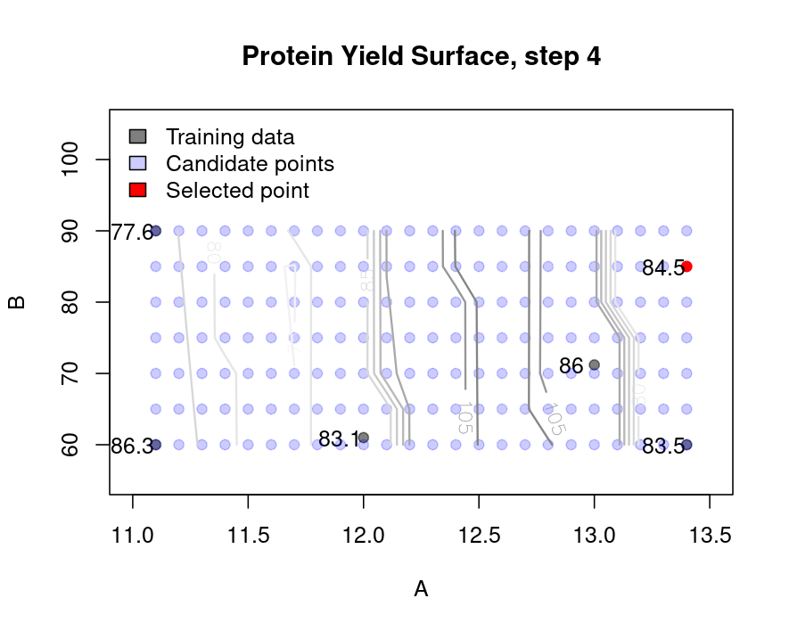{width=72%}

:::

---

## Step 3: Bayesian Optimization {style="font-size:60%;"}

::: {layout-nrow=2 layout-ncol=2}

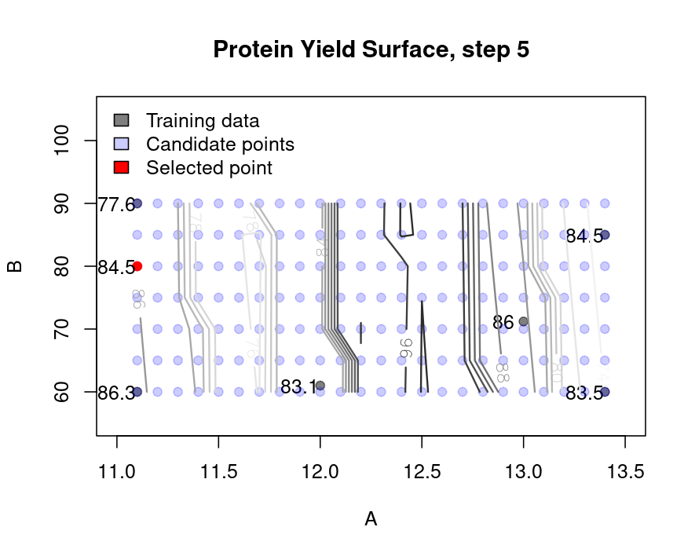{width=72%}

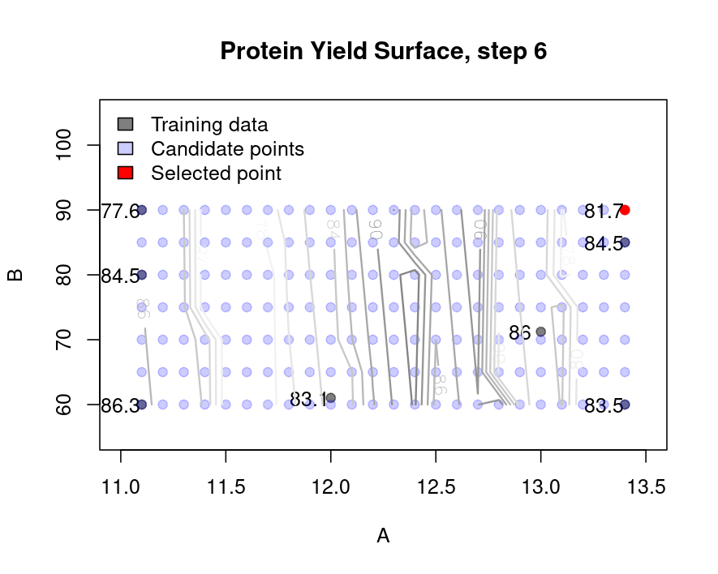{width=72%}

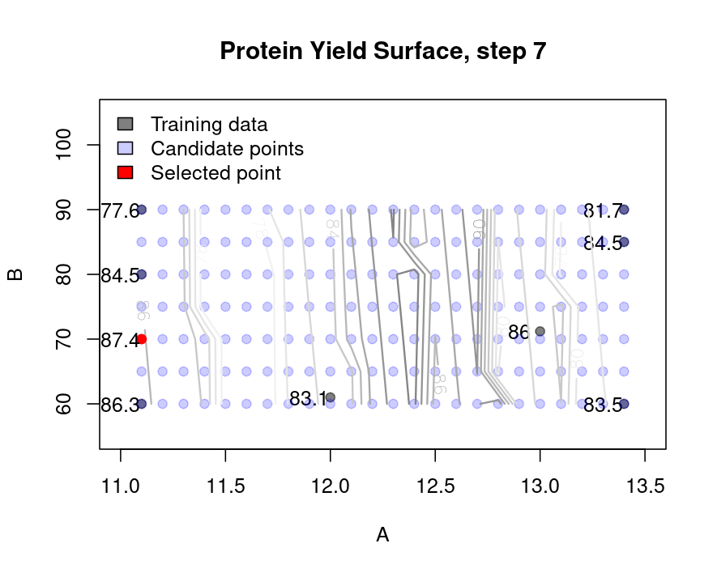{width=72%}

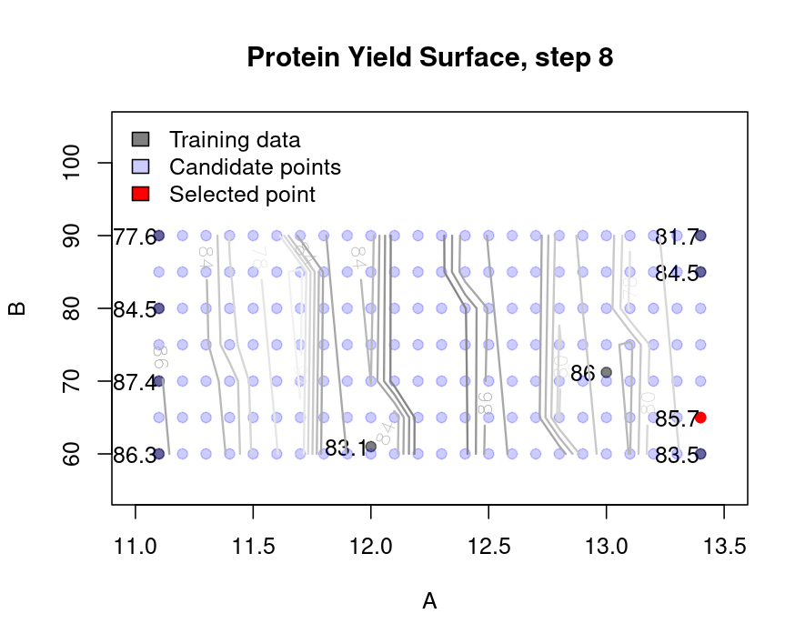{width=72%}

:::

---

## The simulated true yield surface {style="font-size:60%;"}

The "unknown" **true model** for protein yield ($Y$) was:

$$
Y = 85 - 0.4(A-12)^2 - 0.02(B-70)^2 + \sum_{j=3}^{7} 0.01 \cdot X_{j} + 0.1(A-12)(B-70) + e; \quad \; e \sim N(0, 2)
$$

The "unknown" **true** protein yield surface:

```{r}
#| echo: false
#| output: true
#| code-fold: true
#| code-summary: "code"

# validate
post_predict = gaussian_process_regression( 
  X_train = dBO[,1:2], 
  X_predict = x_predict, 
  Y_train = dBO$Y, 
  l=1, sigma_f=1, noise=1e-8 )

Xn = data.frame( x_predict[which.max(post_predict$mu),], dBO[1, 3:7] )
set.seed( seed )
Yn = true_protein_yield( X = as.matrix( Xn ) )
dBO = rbind( dBO, data.frame( Xn, Y=Yn, block='validation' ) )

# adding optimizing and validation points
d = rbind( d, dBO[dBO$block!='ascend',] )
rownames(d) = NULL
write.csv( d, file.path(here(), 'data', 'conducted_experiments.csv') )

```

```{r}
#| echo: false
#| output: true
#| code-fold: true
#| code-summary: "code"

# simulation
set.seed( seed )
X = true_covariates( n=1000 )
Y = true_protein_yield( X=X )
dT = data.frame( X, Y)
m = rsm( Y ~ FO(X1,X2) + TWI(X1,X2) + PQ(X1,X2), data=dT )
Y_hat = predict(m)
X_max = X[which.max(Y_hat),]
Y_max = Y_hat[which.max(Y_hat)]

```

```{r}
#| echo: false
#| output: true
#| code-fold: true
#| code-summary: "code"

# plot
cols = hcl.colors(4,'mako')

contour( m, ~ X1+X2, image=T, xlabs=c("pH", "Temperature (ºC)") )
abline( v=X_max[1], h=X_max[2], lty=2, col=rgb(0,0,0,0.3) )
points( x=X_max[1], y=X_max[2], pch=19, col='red')
text( x=X_max[1]-0.5, y=X_max[2]-5, labels = round( Y_max ,1) )
points( d[ d$block=='screen', 1:2 ], pch=19, col=cols[1] )
points( d[ d$block=='center', 1:2 ], pch=19, col=cols[1] )
points( d[ d$block=='ascend', 1:2 ], pch=19, col=cols[2] )
points( d[ d$block=='BO', 1:2 ], pch=19, col=cols[3] )
points( d[ d$block=='validation', 1:2 ], pch=19, col='orange' )
text( x=d[ d$block=='validation', 1 ]-0.5, y=d[ d$block=='validation', 2 ]-5, 
      labels = round( d$Y[ d$block=='validation' ],1) )
text( d0[,1:2] + 0.5, labels =round(d0$Y,1) )
legend( 'left', bty='n', fill=c(cols[-4],'orange','red'),
        legend=c( 'Screen + center', 'Ascend', 'Optimize', 'Validation','Maximum' ) )


```

::: {.notes}
- In reality the **true model** is not available to us.
- However, simulation is useful to showcase the potential of the experimental strategies.
:::


---

## Conclusion {style="font-size:60%;"}

1. **Result:** a "good" level of optimization with $33$ experimental runs:

    - `r sum(d$block=='screen')` screening points,
    - `r sum(d$block=='center')` center points,
    - `r sum(d$block=='ascend')` steepest ascend points,
    - `r sum(d$block=='BO')` optimization points,
    - `r sum(d$block=='validation')` validation point
    
2. **Reproducibility:** 

    Specific *seed* allows us to reproduce this study with the same results.

3. **Replicability:**

    This is one simulation! How well does the process replicate to multiple simulations?

More discussion in the **Annexes**


---

## Thank you {.center-xy}

::: {.notes}
To conclude I can say that, 

:::


---

## Questions? {.center-xy}


---

## Annex: LCB space {style="font-size:60%;"}

::: {layout-nrow=2 layout-ncol=2}

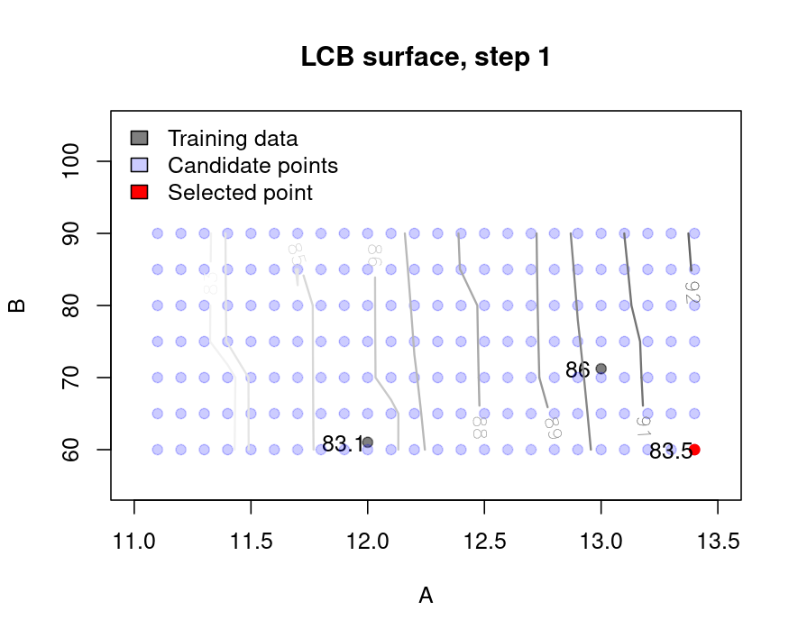{width=72%}

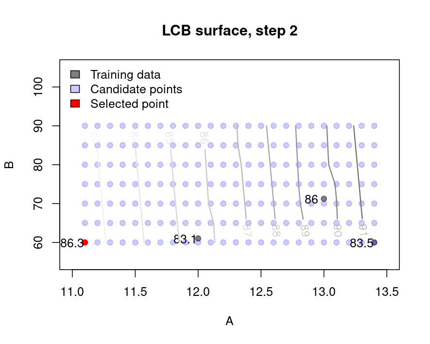{width=72%}

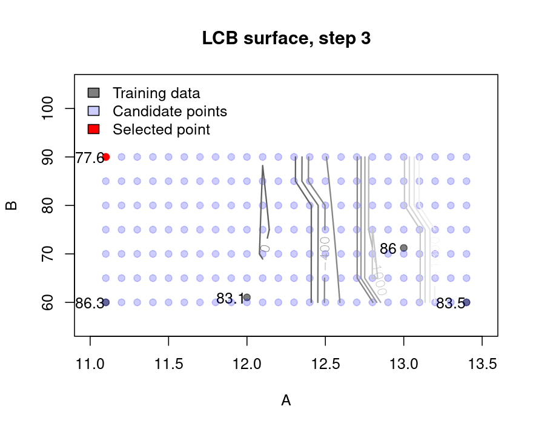{width=72%}

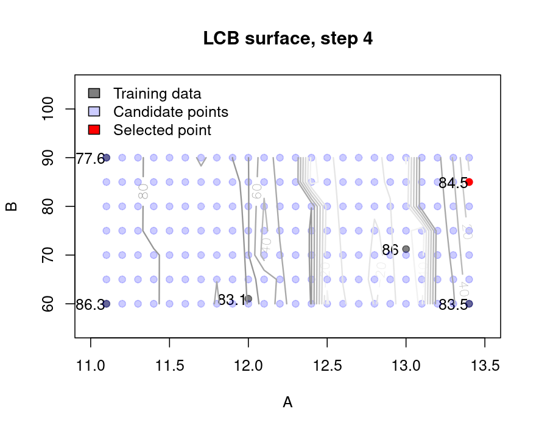{width=72%}

:::


## Annex: LCB space {style="font-size:60%;"}

::: {layout-nrow=2 layout-ncol=2}

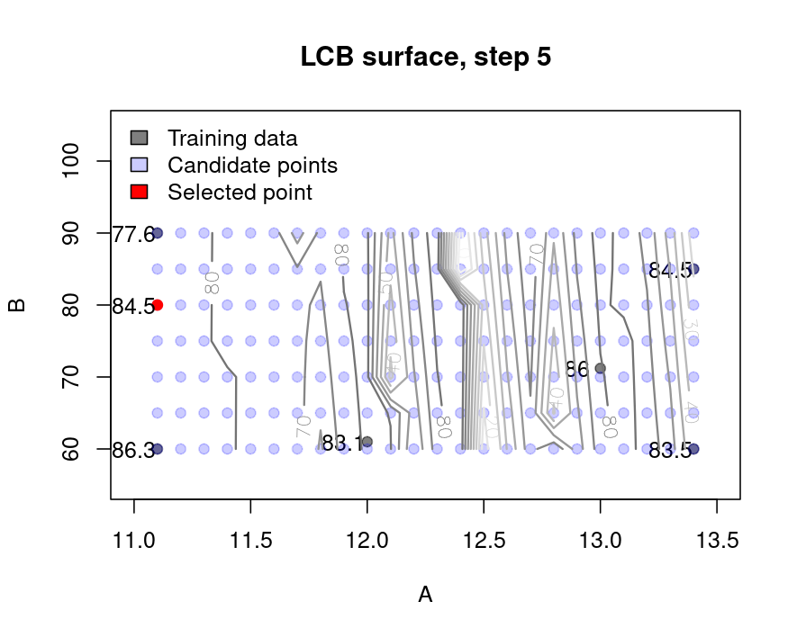{width=72%}

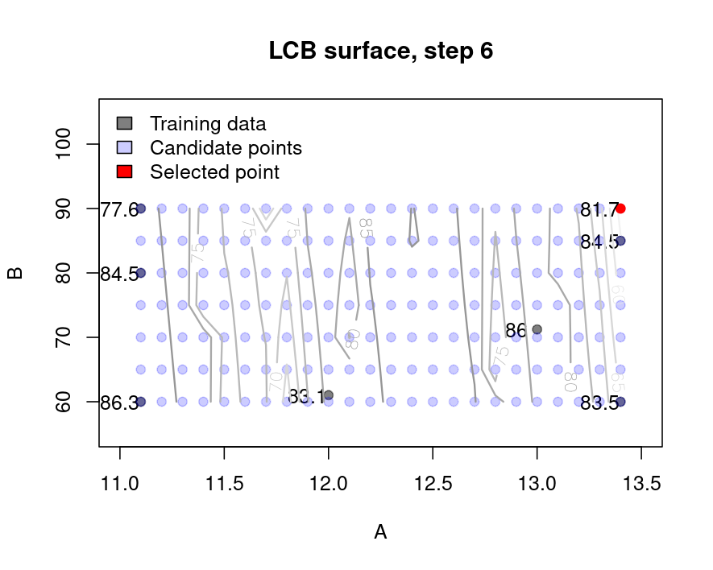{width=72%}

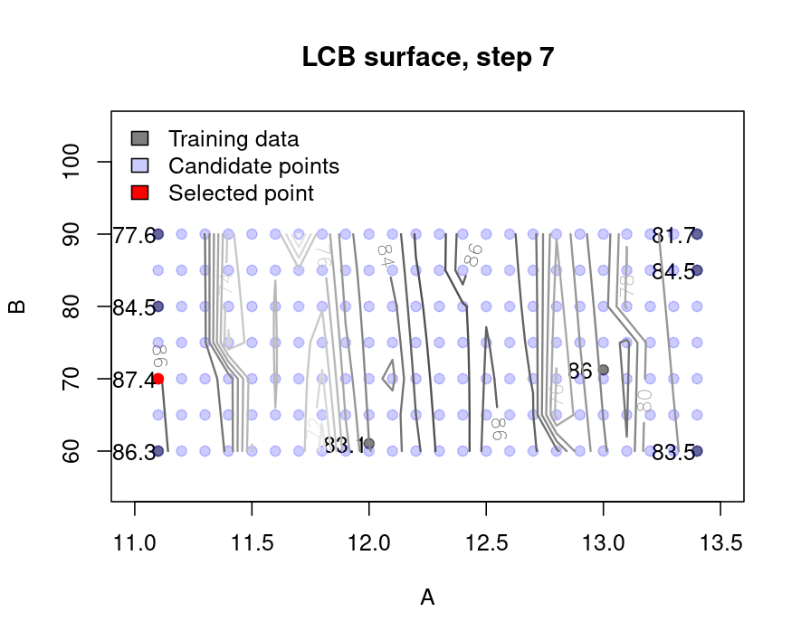{width=72%}

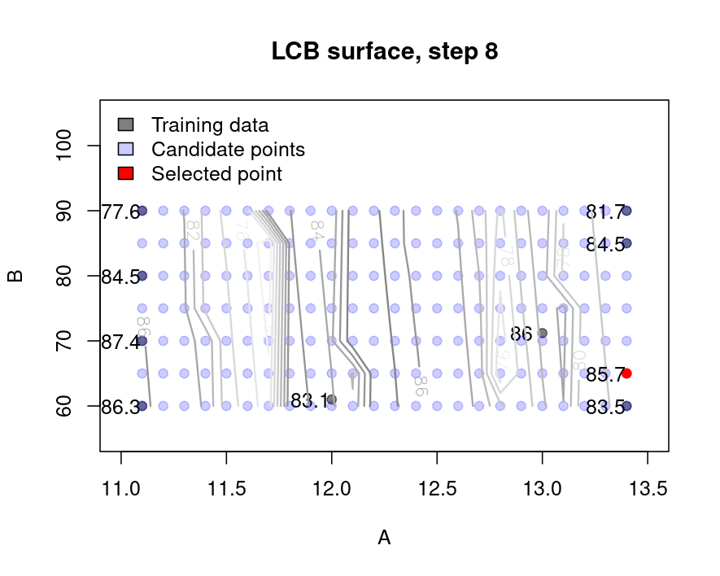{width=72%}

:::


---

## Annex: Additional considerations {style="font-size:60%;"}

What happens when the problem grows?

* **Multiple Objectives:** If we need high **Yield** but low **Waste**, we employ **Desirability Functions** to find the "Sweet Spot" that balances both.
* **Extrapolation:**
    * Empirical models (RSM/BO) are dangerous outside their tested range.
    * If we must predict outside our data, we shift toward **Theoretical/Mechanistic Models** based on biological first principles.


---

## Annex: FAIR principles {style="font-size:60%;"}

This presentation is built to be a **research object**, not just a slide deck.

- **Findable (F):** Searchable text and structured metadata ensure the content is discoverable. 
    
    Next step: Provision of a DOI via Zenodo or OSF.

- **Accesible (A):** Publicly hosted on GitHub. 

    Anyone with an internet connection can retrieve the slides and underlying data.

- **Interoperable (I):** Built using Open Source (Quarto/`R`).

    Seamlessly integrates into any analysis workflow and automated pipelines.
    
- **Reusable (R):** BSD 3 Licensed.

    Includes all `R` dependencies and source code to fully replicate every simulation and analysis. 


---

## References {style="font-size:60%;"}

:::{#refs style="font-size:80%;"}

:::
